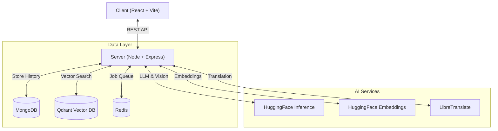
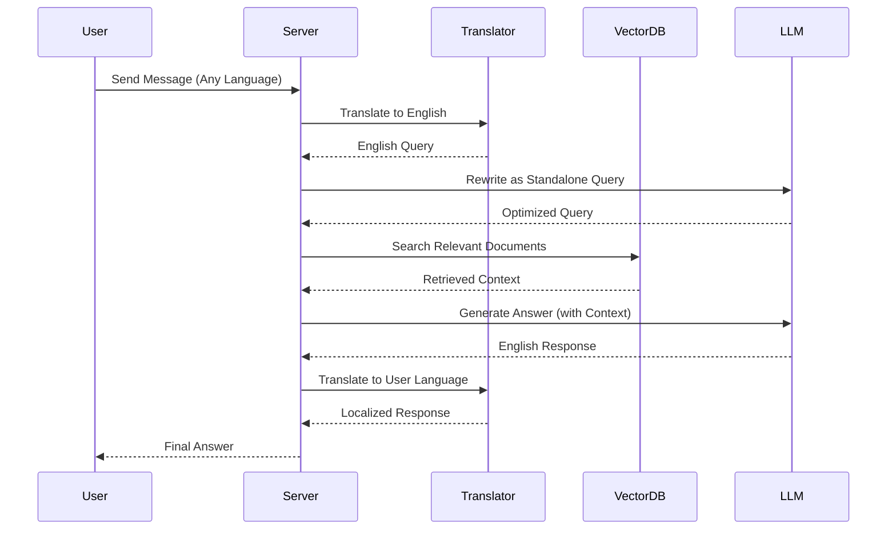
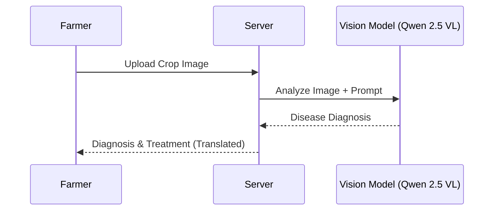

# 🌾 AgroSathi — Agriculture Intelligence Platform

**AgroSathi** is a comprehensive, open-source AI-powered agriculture assistance platform built using Retrieval-Augmented Generation (RAG). It empowers farmers with accurate, document-grounded answers to their questions about soil, crops, irrigation, pests, and farming practices.

The platform combines advanced LLMs for text-based queries with vision-language models for disease detection, offering a complete digital companion for modern farming.

---

## ✨ Key Features

### 🤖 **Intelligent Agricultural Assistant (RAG)**
-   **Document Grounding**: Ingests agricultural PDFs to provide answers strictly based on authoritative sources, reducing hallucinations.
-   **Semantic Search**: Uses **Qdrant** and **HuggingFace** embeddings to find the most relevant context for every query.
-   **Multi-Turn Conversations**: Remembers context from previous messages to handle follow-up questions naturally.
-   **Query Rewriting**: Automatically refines vague follow-up questions into standalone queries for better retrieval.

### 🍃 **Pest & Disease Detection**
-   **Visual Diagnosis**: Farmers can upload photos of crops to instantly identify diseases.
-   **AI Analysis**: Powered by **Qwen 2.5 VL** (Vision-Language Model), it detects issues with high accuracy.
-   **Actionable Advice**: Provides detailed severity assessments, treatment recommendations, and prevention measures.
-   **Multilingual Output**: Disease reports are automatically translated into the user's preferred language.

### 🌐 **Multilingual Support**
-   **Real-Time Translation**: Seamlessly translates queries and responses between English and Indian languages using **LibreTranslate**.
-   **Supported Languages**: Hindi, Bengali, Tamil, Telugu, Marathi, Kannada, Malayalam, Gujarati, Punjabi, and Urdu.
-   **Voice Input**: Supports speech-to-text for accessible interaction in native languages.

### 🔐 **Secure & Robust Architecture**
-   **Authentication**: Secure JWT-based login for Users and Admins.
-   **Chat Management**:
    -   Persistent chat history stored in **MongoDB**.
    -   Separate history tracking for General Chat and Disease Detection.
    -   Ability to rename and delete conversations.
-   **Admin Dashboard**: Secure capabilities for authorized personnel to upload and manage reference documents (PDFs).

---

## 🧩 Architecture & Workflows

### System Architecture



### 🔄 RAG Chat Workflow



### 🍃 Disease Detection Flow



---

---

## 📂 Project Structure

### Backend (`server/`)
-   **`config/`**: Database, AI, and Queue configuration.
-   **`controllers/`**: Request handling logic (`chatController`, `diseaseController`, etc.).
-   **`routes/`**: API route definitions mapping to controllers.
-   **`services/`**: Business logic helpers (`aiService`, `visionService`, `translationService`).
-   **`utils/`**: Shared utilities (`response` helpers, etc.).

### Frontend (`client/`)
-   **`src/components/`**: Reusable UI components (`Sidebar`, `WeatherWidget`).
-   **`src/pages/`**: Main application views (`Chatbot.jsx`).

---

## 🏗️ Tech Stack

### **Frontend**
-   **Framework**: [React](https://react.dev/) (Vite)
-   **Styling**: [Tailwind CSS](https://tailwindcss.com/)
-   **Animations**: [Framer Motion](https://www.framer.com/motion/)
-   **Icons**: [Lucide React](https://lucide.dev/)
-   **State & Routing**: React Router DOM

### **Backend**
-   **Runtime**: [Node.js](https://nodejs.org/)
-   **Framework**: [Express.js](https://expressjs.com/)
-   **Database**: [MongoDB](https://www.mongodb.com/) (Mongoose)
-   **Vector Database**: [Qdrant](https://qdrant.tech/)
-   **Queue System**: [BullMQ](https://docs.bullmq.io/) with [Redis](https://redis.io/)
-   **AI Framework**: [LangChain](https://js.langchain.com/)

### **AI & Models**
-   **Chat LLM**: **Qwen 2.5 72B Instruct** (via [HuggingFace Inference](https://huggingface.co/))
-   **Vision Model**: **Qwen 2.5 VL 7B Instruct** (via HuggingFace Inference)
-   **Query Rewriter**: **Meta-Llama 3.1 8B Instruct** (via HuggingFace Inference)
-   **Embeddings**: `sentence-transformers/all-MiniLM-L6-v2`
-   **Translation**: [LibreTranslate](https://libretranslate.com/)

---

## 🐳 Running the Project with Docker

### Prerequisites
-   [Docker & Docker Compose](https://www.docker.com/)

### Quick Start

1. **Clone the repository**:
```bash
git clone <repository-url>
cd agricultural-chat-bot
```

2. **Configure environment variables**:
Create a `.env` file in the `server` directory:
```env
# Database
MONGODB_URI=mongodb://localhost:27017/agrosathi
QDRANT_URL=http://qdrant:6333
REDIS_HOST=valkey
REDIS_PORT=6379

# AI Services
HUGGINGFACE_API_KEY=your_hf_key_here
LIBRETRANSLATE_URL=http://libretranslate:5000

# Auth & Admin
JWT_SECRET=your_jwt_secret_here
ADMIN_USERNAME=admin
ADMIN_PASSWORD=secure_password_here
ADMIN_JWT_SECRET=your_admin_secret_here
```

3. **Start all services**:
```bash
docker-compose up --build
```

This will start:
- **Frontend** at `http://localhost:5173`
- **Backend API** at `http://localhost:8000`
- **Qdrant** (Vector DB) at `http://localhost:6333`
- **Valkey** (Redis) at `http://localhost:6379`
- **LibreTranslate** at `http://localhost:5000`

4. **Access the application**:
Open your browser and navigate to `http://localhost:5173`

---

## 🛠️ Development Mode

The Docker setup includes **hot-reload** for both frontend and backend:
- Edit files in `client/` or `server/` and see changes instantly
- No need to rebuild containers for code changes

To view logs:
```bash
docker-compose logs -f backend
docker-compose logs -f worker
docker-compose logs -f client
```

To stop all services:
```bash
docker-compose down
```

---

## 📚 API Endpoints

### Authentication
- `POST /auth/signup` - User registration
- `POST /auth/login` - User login
- `POST /admin/login` - Admin login

### Chat
- `POST /chat/create` - Create new chat session
- `GET /chat/list` - Get all chat sessions
- `GET /chat/history/:chatId` - Get chat history
- `POST /chat` - Send message (RAG-based response)
- `DELETE /chat/:chatId` - Delete chat session

### Disease Detection
- `POST /chat/disease/create` - Create disease detection session
- `POST /chat/disease-detect` - Upload image for diagnosis
- `GET /chat/disease/history/:chatId` - Get diagnosis history

### Admin
- `POST /upload/pdf` - Upload agricultural reference documents

---

## 🔑 Getting HuggingFace API Key

1. Create a free account at [HuggingFace](https://huggingface.co/)
2. Go to [Settings > Access Tokens](https://huggingface.co/settings/tokens)
3. Create a new token with "Read" permissions
4. Copy the token and add it to your `.env` file

---

## 🤝 Contributing

Contributions are welcome! Please feel free to submit a Pull Request.

---

## 📄 License

This project is open-source and available under the MIT License.

---

## 🙏 Acknowledgments

- **HuggingFace** for providing free inference API
- **Qwen Team** for the excellent Qwen 2.5 models
- **Meta** for Llama 3.1 models
- **LibreTranslate** for open-source translation