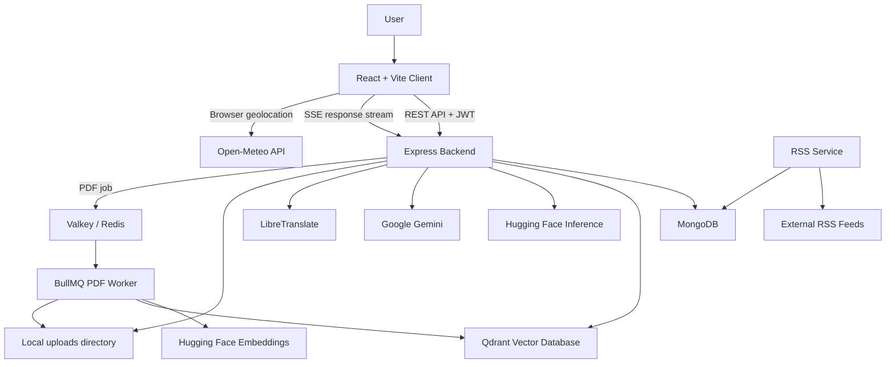
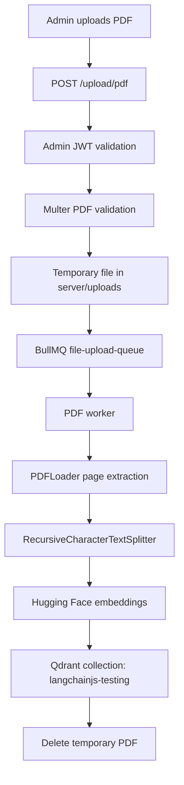
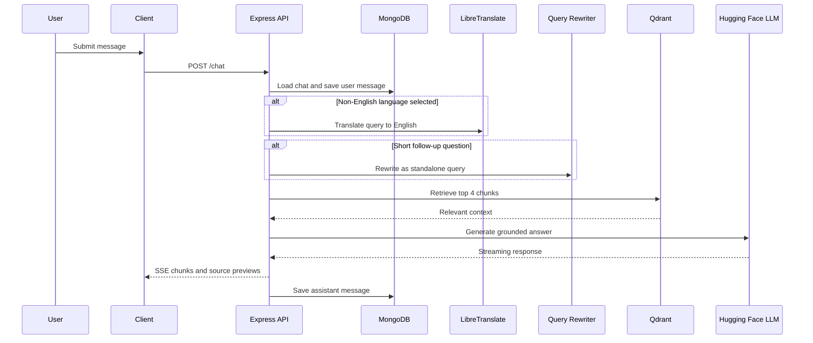

# AgroSathi

AgroSathi is an agriculture intelligence platform that combines a React chat interface, an Express API, a Retrieval-Augmented Generation (RAG) pipeline, image-based crop diagnosis, weather lookup, and agricultural notices. The repository is organized as three runnable services:

- `client/`: React + Vite single-page application.
- `server/`: Express API, MongoDB models, RAG orchestration, disease diagnosis, PDF upload, and BullMQ worker.
- `rss-service/`: Scheduled RSS ingestion service for agricultural news and government schemes.

The implementation uses MongoDB for user and application data, Qdrant for vector retrieval, Valkey/Redis for PDF ingestion jobs, Hugging Face for text generation and embeddings, Google Gemini for image diagnosis, LibreTranslate for translation support, and Open-Meteo for browser-side weather data.

## Implemented Features

### User Authentication

Users can sign up and log in using email and password. Passwords are hashed with `bcryptjs`, and authenticated requests use JWT Bearer tokens. User tokens are stored by the frontend in `localStorage`.

Implemented in:

- `server/routes/auth.js`
- `server/middleware/auth.js`
- `server/models/User.js`
- `client/src/pages/Login.jsx`
- `client/src/pages/Signup.jsx`

### RAG Agriculture Chat

The chat module allows authenticated users to create chat sessions, ask agriculture-related questions, receive streamed responses, view retrieved source previews, and delete sessions. The backend retrieves relevant chunks from Qdrant, constructs a context-grounded prompt, and streams a response from `Qwen/Qwen2.5-72B-Instruct` through Hugging Face Inference.

Implemented in:

- `server/controllers/chatController.js`
- `server/config/ai.js`
- `server/services/aiService.js`
- `server/services/translationService.js`
- `client/src/pages/Chatbot.jsx`
- `client/src/components/chat/Sidebar.jsx`

### Admin PDF Upload and Vector Indexing

Administrators can upload agricultural reference PDFs. Uploaded PDFs are queued through BullMQ and processed by a worker. The worker extracts PDF text with LangChain `PDFLoader`, splits text into chunks of 1000 characters with 200 characters of overlap, generates Hugging Face embeddings using `sentence-transformers/all-MiniLM-L6-v2`, and stores vectors in Qdrant.

Implemented in:

- `server/routes/upload.js`
- `server/controllers/uploadController.js`
- `server/utils/multer.js`
- `server/config/queue.js`
- `server/worker.js`
- `client/src/pages/AdminLogin.jsx`
- `client/src/pages/AdminUpload.jsx`

### Crop Disease Detection

The Crop Doctor mode accepts a crop image and a user description. The backend stores the uploaded image locally, sends the image and prompt to Google Gemini `gemini-2.5-flash`, and streams a generated diagnosis back to the client. The prompt asks for disease identification, severity, treatment recommendations, and prevention measures.

Implemented in:

- `server/routes/chat.js`
- `server/routes/disease.js`
- `server/controllers/diseaseController.js`
- `server/services/visionService.js`
- `server/models/DiseaseDetection.js`
- `client/src/pages/Chatbot.jsx`

Note: the repository does not contain a locally trained disease-classification model. Disease analysis is performed by the external Gemini vision-language model.

### Multilingual Interaction

The frontend exposes a language selector for English, Hindi, Bengali, Tamil, Telugu, Marathi, Kannada, Malayalam, Gujarati, Punjabi, and Urdu. For non-English retrieval, the backend attempts to translate the query to English with LibreTranslate. The chat prompt asks the LLM to respond in the selected language. Disease diagnosis similarly asks Gemini to respond in the selected language.

Implemented in:

- `server/services/translationService.js`
- `server/controllers/chatController.js`
- `server/services/visionService.js`
- `client/src/pages/Chatbot.jsx`

### Voice Input and Text-to-Speech

The frontend supports browser-native speech recognition where available and can read assistant responses aloud using the Web Speech API.

Implemented in:

- `client/src/pages/Chatbot.jsx`
- `client/src/utils/tts.js`

### Weather Forecast

The weather widget uses browser geolocation and calls Open-Meteo directly from the frontend. It displays current temperature, humidity, wind speed, rain probability, rainfall volume, and a 7-day forecast.

Implemented in:

- `client/src/pages/Chatbot.jsx`
- `client/src/components/chat/WeatherWidget.jsx`

### Notices, Schemes, and News

The RSS service fetches whitelisted RSS feeds every 12 hours, deduplicates items using a SHA-256 hash, strips HTML from feed snippets, truncates summaries, and stores notices in MongoDB. The backend exposes notices through a paginated API, and the frontend displays them in both a modal widget and a dedicated notices page.

Implemented in:

- `rss-service/index.js`
- `rss-service/jobs/rssExecutor.js`
- `rss-service/services/rssParser.js`
- `rss-service/models/Notice.js`
- `server/controllers/noticeController.js`
- `server/models/Notice.js`
- `client/src/components/chat/NoticesWidget.jsx`
- `client/src/pages/Notices.jsx`

Note: the current RSS implementation does not call an LLM for summarization; summaries are derived from RSS content snippets.

## Architecture



## RAG Workflow

### PDF Ingestion



### Chat Response Generation



## Technology Stack

### Frontend

- React 19
- Vite
- React Router
- Tailwind CSS
- Framer Motion
- Lucide React
- React Markdown
- Browser Web Speech API
- Browser Geolocation API

### Backend

- Node.js 20
- Express 4
- Mongoose
- MongoDB
- JWT authentication
- bcryptjs password hashing
- Multer uploads
- Server-Sent Events for streamed chat responses

### AI and Retrieval

- Hugging Face Inference
- `Qwen/Qwen2.5-72B-Instruct` for chat response generation
- `meta-llama/Meta-Llama-3.1-8B-Instruct` for short-query rewriting
- `sentence-transformers/all-MiniLM-L6-v2` for embeddings
- LangChain PDF loader, text splitter, and Qdrant integration
- Qdrant vector database
- Google Gemini `gemini-2.5-flash` for image-based crop diagnosis
- LibreTranslate for query/fallback translation support

### Background Services

- BullMQ
- Valkey/Redis
- RSS Parser
- node-cron

### Containerization

- Docker
- Docker Compose
- Node 20 Alpine images

## Project Structure

```text
AgroSathi/
  client/
    src/
      components/
      pages/
      utils/
    Dockerfile
    package.json
    vite.config.js
  server/
    config/
    controllers/
    middleware/
    models/
    routes/
    services/
    utils/
    index.js
    worker.js
    Dockerfile
    package.json
  rss-service/
    config/
    jobs/
    models/
    scripts/
    services/
    index.js
    Dockerfile
    package.json
  docker-compose.yml
  README.md
```

## API Endpoints

### Authentication

| Method | Endpoint | Description |
| --- | --- | --- |
| POST | `/auth/signup` | Register a user |
| POST | `/auth/login` | Log in a user |
| POST | `/admin/login` | Log in an administrator |

### Chat

| Method | Endpoint | Description |
| --- | --- | --- |
| POST | `/chat/create` | Create a chat session |
| GET | `/chat/list` | List normal and disease chats for the authenticated user |
| GET | `/chat/history/:chatId` | Get normal chat history |
| POST | `/chat` | Send a RAG chat message |
| DELETE | `/chat/:chatId` | Delete a normal chat, with fallback deletion for disease chat |

### Disease Detection

| Method | Endpoint | Description |
| --- | --- | --- |
| POST | `/chat/disease/create` | Create a disease-detection chat |
| GET | `/chat/disease/list` | List disease-detection chats |
| GET | `/chat/disease/history/:chatId` | Get disease-detection history |
| DELETE | `/chat/disease/:chatId` | Delete disease-detection chat |
| POST | `/chat/disease-detect` | Upload crop image and receive diagnosis |

### Admin Upload

| Method | Endpoint | Description |
| --- | --- | --- |
| POST | `/upload/pdf` | Upload PDF for background vector indexing |

### Notices

| Method | Endpoint | Description |
| --- | --- | --- |
| GET | `/api/notices` | Get paginated notices |

Supported notice query parameters:

- `page`
- `limit`
- `type`, where type is `GOVERNMENT` or `AGRI_NEWS`

## Environment Variables

Create `server/.env`:

```env
PORT=8000
MONGODB_URI=your_mongodb_connection_string
JWT_SECRET=your_user_jwt_secret
ADMIN_USERNAME=admin
ADMIN_PASSWORD=your_admin_password
ADMIN_JWT_SECRET=your_admin_jwt_secret
HUGGINGFACE_API_KEY=your_huggingface_api_key
GEMINI_API_KEY=your_gemini_api_key
QDRANT_URL=http://qdrant:6333
REDIS_HOST=valkey
REDIS_PORT=6379
LIBRETRANSLATE_URL=http://libretranslate:5000
```

Create `client/.env`:

```env
VITE_API_BASE=http://localhost:8000
```

Create `rss-service/.env`:

```env
MONGODB_URI=your_mongodb_connection_string
```

## Running with Docker Compose

Prerequisites:

- Docker
- Docker Compose
- A reachable MongoDB instance configured through `MONGODB_URI`

Start all services:

```bash
docker-compose up --build
```

Default service URLs:

| Service | URL |
| --- | --- |
| Client | `http://localhost:5173` |
| Backend API | `http://localhost:8000` |
| Qdrant | `http://localhost:6333` |
| Valkey/Redis | `localhost:6379` |
| LibreTranslate | `http://localhost:5000` |

Important: `docker-compose.yml` does not define a MongoDB container. Use a local, remote, or managed MongoDB deployment and set `MONGODB_URI` accordingly.

## Local Development

Install and run each service separately if you do not want to use Docker.

Backend:

```bash
cd server
pnpm install
pnpm dev
```

PDF worker:

```bash
cd server
pnpm dev:worker
```

Frontend:

```bash
cd client
npm install
npm run dev
```

RSS service:

```bash
cd rss-service
npm install
npm start
```

## Data Storage

MongoDB collections store:

- Users
- Normal chat sessions
- Disease-detection chat sessions
- Notices from RSS feeds

Qdrant stores:

- Embedded PDF chunks
- Chunk metadata, including filename and source

Local filesystem stores:

- Temporary uploaded PDFs before worker processing
- Uploaded crop images under `server/uploads/images`

## Security Notes

The project implements JWT authentication, bcrypt password hashing, admin-only PDF upload, file type validation, and upload size limits. The current implementation also has limitations that should be addressed before production deployment:

- CORS is enabled globally without an origin allowlist.
- JWTs are stored in browser `localStorage`.
- Uploaded images are served as static files without per-file authorization.
- Admin credentials are environment variables rather than hashed database records.
- There is no rate limiting, request throttling, antivirus scanning, or audit logging in the repository.
- HTTPS termination is not configured in the repository.

## Known Implementation Notes

- Disease diagnosis uses Google Gemini `gemini-2.5-flash`, not a local disease classifier.
- RSS notices currently use cleaned and truncated RSS snippets, not LLM-generated summaries.
- The Qdrant collection name is `langchainjs-testing`.
- Uploaded PDF metadata is stored in Qdrant chunk metadata; there is no separate MongoDB document registry for uploaded PDFs.
- Source previews are streamed to the client after chat generation. The current `Chat` message schema does not explicitly define a `sources` field.
- Weather data is fetched directly from Open-Meteo by the browser, not by the backend.

## License

This project currently declares `ISC` in `server/package.json`. Add a root-level license file if a repository-wide license is required.
