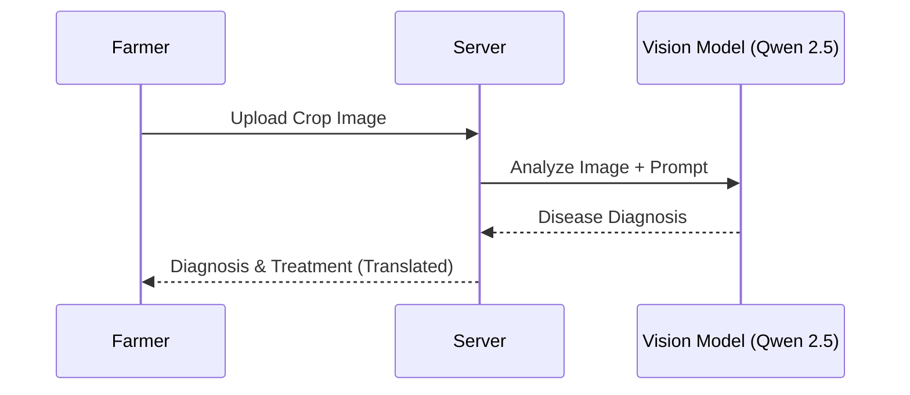

# 🌾 KisanAI — Agriculture Intelligence Platform (RAG)

**KisanAI** is a comprehensive, open-source AI-powered agriculture assistance platform built using Retrieval-Augmented Generation (RAG). It empowers farmers with accurate, document-grounded answers to their questions about soil, crops, irrigation, pests, and farming practices, strictly based on verified agricultural methods.

The platform combines advanced LLMs for text-based queries with vision-language models for disease detection, offering a complete digital companion for modern farming.

---

## ✨ Key Features

### 🤖 **Intelligent Agricultural Assistant (RAG)**
-   **Document Grounding**: Ingests agricultural PDFs to provide answers strictly based on authoritative sources, reducing hallucinations.
-   **Semantic Search**: Uses **Qdrant** and **HuggingFace** embeddings to find the most relevant context for every query.
-   **Multi-Turn Conversations**: Remembers context from previous messages to handle follow-up questions naturally.
-   **Query Rewriting**: Automatically refines vague follow-up questions (e.g., "How much water does it need?") into standalone queries (e.g., "How much water does wheat need?") for better retrieval.

### 🍃 **Pest & Disease Detection**
-   **Visual Diagnosis**: Farmers can upload photos of crops to instantly identify diseases.
-   **AI Analysis**: Powered by **Qwen 2.5 VL** (Vision-Language Model), it detects issues with high accuracy.
-   **Actionable Advice**: Provides detailed severity assessments, treatment recommendations, and prevention measures.
-   **Multilingual Output**: Disease reports are automatically translated into the user's preferred language.

### 🌐 **Multilingual Support**
-   **Real-Time Translation**: Seamlessly translates queries and responses between English and Indian languages using **LibreTranslate**.
-   **Supported Languages**: Hindi, Bengali, Tamil, Telugu, Marathi, Kannada, Malayalam, Gujarati, Punjabi, and Urdu.
-   **Voice Input**: Supports speech-to-text for accessible interaction in native languages.

### 🔐 **Secure & Robust Architecture**
-   **Authentication**: Secure JWT-based login for Users and Admins.
-   **Chat Management**:
    -   Persistent chat history stored in **MongoDB**.
    -   Separate history tracking for General Chat and Disease Detection.
    -   Ability to rename and delete conversations.
-   **Admin Dashboard**: secure capabilities for authorized personnel to upload and manage reference documents (PDFs).

---

## 🧩 Architecture & Workflows

### System Architecture

```mermaid
graph TD
    Client[Client (React + Vite)] <-->|REST API| Server[Server (Node + Express)]
    
    subgraph Data Layer
        Server <-->|Store History| Mongo[(MongoDB)]
        Server <-->|Vector Search| Qdrant[(Qdrant Vector DB)]
        Server <-->|Job Queue| Redis[(Redis)]
    end
    
    subgraph AI Services
        Server <-->|LLM & Vision| A4F[A4F / HuggingFace]
        Server <-->|Embeddings| HF_Embed[HuggingFace Embeddings]
        Server <-->|Translation| Libre[LibreTranslate]
    end
```

### 🔄 RAG Chat Workflow


### 🍃 Disease Detection Flow



---

## 🏗️ Tech Stack

### **Frontend**
-   **Framework**: [React](https://react.dev/) (Vite)
-   **Styling**: [Tailwind CSS](https://tailwindcss.com/)
-   **Animations**: [Framer Motion](https://www.framer.com/motion/)
-   **Icons**: [Lucide React](https://lucide.dev/)
-   **State & Routing**: React Router DOM

### **Backend**
-   **Runtime**: [Node.js](https://nodejs.org/)
-   **Framework**: [Express.js](https://expressjs.com/)
-   **Database**: [MongoDB](https://www.mongodb.com/) (Mongoose)
-   **Vector Database**: [Qdrant](https://qdrant.tech/)
-   **Queue System**: [BullMQ](https://docs.bullmq.io/) with [Redis](https://redis.io/) (for file processing)
-   **AI Framework**: [LangChain](https://js.langchain.com/)

### **AI & Models**
-   **Chat LLM**: **Gemma 2 27B** (via [A4F](https://a4f.co/))
-   **Vision Model**: **Qwen 2.5 VL** (via HuggingFace Inference)
-   **Embeddings**: `sentence-transformers/all-MiniLM-L6-v2`
-   **Query Rewriter**: **Gemma 2 27B**
-   **Translation**: [LibreTranslate](https://libretranslate.com/)

---

## 🐳 Running the Project

### Prerequisites
-   [Docker & Docker Compose](https://www.docker.com/)
-   [Node.js](https://nodejs.org/) (v18+)
-   [pnpm](https://pnpm.io/) (recommended) or npm

### 1. Start Infrastructure Services
Start Qdrant (Vector DB) and Redis (Queue/Cache):
```bash
docker-compose up -d
```

### 2. Backend Setup
Navigate to the server directory and install dependencies:
```bash
cd server
pnpm install
```

Start the background worker (handles PDF processing):
```bash
pnpm dev:worker
```

Start the API server:
```bash
pnpm dev
```
> Server runs at: `http://localhost:8000`

### 3. Frontend Setup
Navigate to the client directory and install dependencies:
```bash
cd client
pnpm install
pnpm run dev
```
> Frontend runs at: `http://localhost:5173`

---

## ⚙️ Environment Variables

Create a `.env` file in the `server` directory with the following:

```env
# Database
MONGODB_URI=mongodb://localhost:27017/kisanai
QDRANT_URL=http://localhost:6333
REDIS_HOST=localhost
REDIS_PORT=6379

# AI Services
HUGGINGFACE_API_KEY=your_hf_key
A4F_API_KEY=your_a4f_key
LIBRETRANSLATE_URL=http://localhost:5000

# Auth & Admin
JWT_SECRET=your_jwt_secret
ADMIN_USERNAME=admin@kisan.ai
ADMIN_PASSWORD=secure_password
ADMIN_JWT_SECRET=your_admin_secret
```

Create a `.env` file in the `client` directory:

<<<<<<< HEAD
```env
VITE_API_URL=http://localhost:8000
```
=======
      pnpm dev:worker

   Start API server

       pnpm dev


    Backend runs at:
👉 http://localhost:8000

- **Frontend Setup**

      cd client
      npm install
      npm run dev


    Frontend runs at:
👉 http://localhost:5173

⚙️ **Environment Variables**

- **Backend (.env)**

       # API Keys
      HUGGINGFACE_API_KEY=your_huggingface_api_key_here
      A4F_API_KEY=your_a4f_api_key_here
      
      # Database URLs
      QDRANT_URL=your_qdrant_url_here
      MONGODB_URI=your_mongodb_uri_here
      
      # Secrets
      JWT_SECRET=your_jwt_secret_here
      ADMIN_JWT_SECRET=your_admin_jwt_secret_here
      
      # Redis Configuration
      REDIS_HOST=your_redis_host_here
      REDIS_PORT=your_redis_port_here
      
      # Admin Credentials
      ADMIN_USERNAME=your_admin_email_here
      ADMIN_PASSWORD=your_admin_password_here

# Server Configuration
PORT=8000

- **Frontend (.env)**
  
         VITE_API_URL=http://localhost:8000
>>>>>>> d9c5a9acb0a71cf0c76d8b522978d470584d5423
